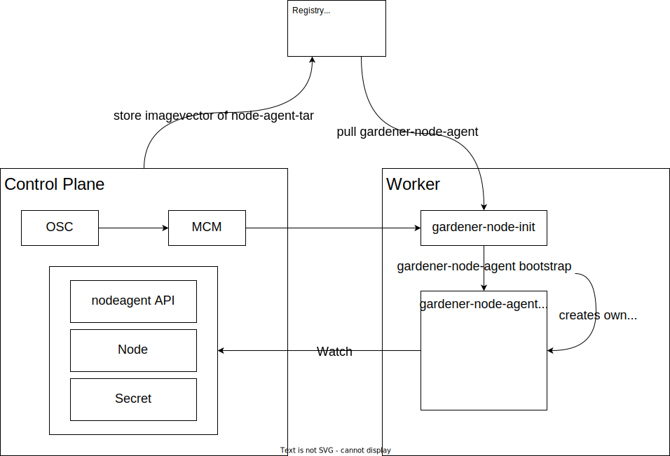

# Gardener Node Agent

This track finally implemented what was on the list of ideas since the first hackathon in 2021. The goal was to get rid of two important components which are responsible to bootstrap a machine into a worker node, the `cloud-config-downloader` and the `cloud-config-executor`, both written in `bash` which is even templated. The sheer complexity of these two scripts, combined with scalability and performance issues urges their removal.

## Basic Design

The basic idea how we wanted to remove the cloud-config-downloader is like this:

- write a very small bash script called `gardener-node-init`, which is carried with the cloud-init data, and then has the sole purpose of downloading and starting a kubernetes controller `gardener-node-agent` responsible for the logic to make the machine a worker node.
- the kubernetes controller on the machine called `gardener-node-agent` will then watch for kubernetes resources and depending of the object and the changes there, will reconcile the worker.

## Architecture

TODO: description

## Gains

With the new Architecture we gain a lot, let's describe the most important gains here.

### Developer productivity

Because we all develop in go day by day, writing business logic in `bash` is difficult, hard to maintain, almost impossible to test. Getting rid of almost all `bash` scripts which are currently in use for this very important part of the cluster creation process will enhance the speed of adding new features and removing bugs.

### Speed

Until now, the `cloud-config-downloader` runs in a loop every 60sec to check if something changed on the shoot which requires modifications on the worker node. This produces a lot of unneeded traffic on the api-server and wastes time, it will sometimes take up to 60sec until a desired modification is started on the worker node.
By using the controller-runtime we can watch for the `node`, the`OSC` in the `secret`, and the shoot-access-token in the `secret`. If any of these object changed, and only then, the required action will take effect immediately.
This will speed up operations and will reduce the load on the api-server of the shoot dramatically.

### Correctness

The configuration of the `cloud-config-downloader` is actually done by placing a file for every configuration item on the disk on the worker node. This was done because parsing the content of a single file and using this as a value in `bash` reduces to something like `VALUE=$(cat /the/path/to/the/file)`. Simple but lacks validation, type safety and whatnot.
With the `gardener-node-agent` we introduce a new API which is then stored in the `gardener-node-agent` `secret` and stored on disc in a single yaml file for comparison with the previous known state. This brings all benefits of type safe configuration.
Because actual and previous configuration are compared, removed files and units are also removed and stopped on the worker if removed from the `OSC`.

### Availability

Previously the `cloud-config-downloader` simply restarted the `systemd-units` on every change to the `OSC`, regardless which of the services changed. The `cloud-config-downloader` first checks which systemd-unit was changed, and will only restart these. This will remove unneeded `kubelet` restarts.

## Pull Requests

In order to bring this work as fast as possible and as smooth as possible into `master` of gardener, we need to split the work into smaller pieces which are easy to review and gradually introduce the new feature.

We propose the following sets of pull requests:

- [] [Make Decoder aware of plaintext encoding](https://github.com/gardener/gardener/pull/7993) this was found missing during the implementation of the gardener-node-agent.
- [] Introduce `gardener-node-agent` and `gardener-node-init` with the required API, push container image with binary inside to registry, do not enable their execution
- [] Put the compiled `OSC` into the secret which is downloaded by the worker bootstrap process, no consumer yet
- [] Enable downloading of the `gardener-node-init` behind a feature-gate
- [] Disable cloud-config-downloader, cloud-config-executor
- [] Remove cloud-config-downloader, cloud-config-executor

## Contributors

- Tim Ebert
- Valenting Knabel
- Gerrit Schwerthelm
- Robin Schneider
- Maximilian Geberl
- Stefan Majer