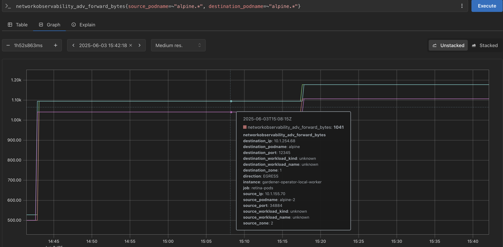

# Hack The Garden 06/2025 Wrap Up

## ⚡️Replace OpenVPN with Wireguard

TODO(tobschli): What are the drawbacks of OpenVPN?
**Problem Statement:** The Gardener VPN implementation between control and data plane currently uses OpenVPN, which is a well-established but somewhat old solution for VPNs.

**Motivation/Benefits:** Wireguard is a relatively new, but well-liked contender in the VPN space. It could be possible to replace OpenVPN with Wireguard. As we do not want to spin up a load balancer per control plane (or use one port per control plane) a reverse proxy like [mwgp](https://github.com/apernet/mwgp) is required.

**Achievements:**

**Next Steps:**

**Code/Pull Requests:**

## ⛳️ Make `gardener-operator` Single-Node Ready

**Problem Statement:** By default, when Gardener is deployed, some components of it are deployed for high availability, assuming multiple nodes in the cluster. This is not necessary or hinders the deployment of Gardener in single-node clusters.

**Motivation/Benefits:** For bare-metal scenarios, sometimes only a single node is available, meaning e.g. multiple replicas of some components are not needed.

**Achievements:**

**Next Steps:**

**Code/Pull Requests:**

## 📡 OpenTelemetry Transport for `Shoot` Metrics

**Problem Statement:** Today the shoot metrics are collected by the control plane prometheus using the kube-apiserver `/proxy` endpoint, without any ability to fine tune the collected metrics sets.

**Motivation/Benefits:** Since we introduce opentelemetry collector instance on the shoots as a replacement of valitail service and on seeds in the shoot control plane namespace, the goal is to try out collecting and filtering the shoot metrics via opentelemetry collector instances also giving the opportunity for filtering and fune tunning of the metrics sets. This story is part of Observability 2.0 initiative.

**Achievements:**

**Next Steps:**

**Code/Pull Requests:**

## 🔬 Cluster Network Observability

**Problem Statement:** It might be beneficial to be able to get deeper insights into the traffic of a Kubernetes cluster. For example, traffic across availability zone boundaries may have increased latency or monetary costs.

**Motivation/Benefits:** There are tools, e.g. https://github.com/microsoft/retina, which allow to gain more detailed insights into the pod network, but may lack some features like availability zone tracking (see https://github.com/microsoft/retina/issues/1179)

**Achievements:**

**Next Steps:**

**Issue:** https://github.com/microsoft/retina/issues/1654

**Code/Pull Requests:** https://github.com/microsoft/retina/pull/1657

## 📝 Signing of `ManagedResource` Secrets

**Problem Statement:**  The secrets of ManagedResources, are currently used as-is by the gardener-resource-manager. This could lead to a bad-actor manipulating these secrets to deploy resources with the permissions of the grm.

**Motivation/Benefits:** To prevent one potential scenario of privilege escalation, we want to sign the secrets of ManagedResources with a key that is only known to the gardener-resource-manager. This way, the grm can verify that the secrets it receives are not manipulated by a bad actor.

**Achievements:**

**Next Steps:**

**Code/Pull Requests:** https://github.com/gardener/gardener/pull/12247

## 🧰 Migrate Control Plane Reconciliation of Provider Extensions to `ManagedResource`s

**Problem Statement:** Currently we deploy control-plane components using the chart applier instead of managed-resources.

**Motivation/Benefits:** This creates some issues where for example if we want to scale a component, we have to do it "manually", e.g. scaling a controller to 0 needs to be done imperatively.

**Achievements:**

**Next Steps:**

**Issue:**
* https://github.com/gardener/gardener/issues/12250 (stretch goal)

**Code/Pull Requests:**
* https://github.com/gardener/gardener/pull/12251
* https://github.com/gardener/gardener/compare/master...metal-stack:gardener:controlplane-objects-provider-interface (stretch goal)

## ✨ Dashboard Usability Improvements

**Problem Statement:** The Gardener Dashboard assumes static, non-configurable defaults for e.g. Shoot values, which may not be suitable for all deployment scenarios.

**Motivation/Benefits:** Some points that could be improved:
- Value Defaulting (landscape scope): e.g. AutoScaler min/max replicas
- Overrides (project scope): Optional labels for Shoots that can be used as a display name to overcome the project name length limit
- Hide UI Elements (landscape scope): e.g. Control Plane HA
- Add new UI Elements (stretch goal): would require extensibility concept for the dashboard

**Achievements:**

**Next Steps:**

**Issue:** https://github.com/gardener/dashboard/issues/2469

**Code/Pull Requests:**
* Project Title – https://github.com/gardener/dashboard/pull/2470
* Value Defaulting – https://github.com/gardener/dashboard/pull/2476

## ⚖️ Cluster-internal L7 Load-Balancing Endpoints for `kube-apiserver`s

**Problem Statement:** In the last hackathon we created an L7 load-balancing for the external endpoints of Gardener kube-apiservers (Shoots & Virtual Garden). However, cluster internal traffic like from gardener-resource-manager and gardener-controller-manager accesses the Kubernetes internal services directly, skips Istio and so the L7 load-balancing. We noticed at least for gardener-controller-manager that it could generate some load to the gardener-apiserver.

**Motivation/Benefits:** Thus, it would be nice to have a cluster internal load-balancing too. We don't want to use the external endpoint since depending on the infrastructure this could create additional external traffic.

**Achievements:**

**Next Steps:**

**Issue:** https://github.com/gardener/gardener/issues/8810

**Code/Pull Requests:** https://github.com/gardener/gardener/pull/12260

## 📜 Documentation Revamp

**Problem Statement:** Usually, the individual content of our documentation is of high quality and helpful. However, we typically receive complaints about the structure and explorability of our documentation.

**Motivation/Benefits:** With improved documentation, especially in regard to accessibility for new Gardeners🧑‍🌾, we can greatly improve the impact of the project whilst also putting off load for people answering questions.

**Achievements:**

**Next Steps:**

**Code/Pull Requests:**

## ℹ️ Expose EgressCIDRs in shoot-info `ConfigMap` 🏎️

**Problem Statement:** Some stakeholders need to know the egress CIDRs of a shoot cluster.

**Motivation/Benefits:** Helps expose meta-level information about the shoot to workloads of the shoot. This could be useful in case of controllers e.g. crossplane that run on the shoot and need access to some information of the existing infrastructure.

**Achievements:**

**Next Steps:**

**Code/Pull Requests:** https://github.com/gardener/gardener/pull/12252

## 📈 Overcome Maximum of 450 `Node`s on Azure

**Problem Statement:** Extensions that do not rely on overlay networking for their in-cluster networking usually rely on other mechanisms such as route tables to establish p2p traffic. Azure being one of them. We currently face scaling difficulties as clusters generally approach the maximum size of route tables set by the provider and we need a new network architecture to overcome this limitation.

**Motivation/Benefits:** Potentially can be used as a reference for other providers reaching same limits.

**Achievements:**

**Next Steps:**

**Code/Pull Requests:**

## 🦜 Multiple Parallel Versions in a Gardener Landscape (fka. Canary Deployments)

**Problem Statement:** 

**Motivation/Benefits:**

**Achievements:**

**Next Steps:**

**Code/Pull Requests:**

## ♻️ GEP-32 – Version Classification Lifecycles 🏎️

**Problem Statement:**

**Motivation/Benefits:**

**Achievements:**

**Next Steps:**

**Code/Pull Requests:** https://github.com/metal-stack/gardener/pull/9

## 🧑‍🔧 Worker Group Node Roll-out 🏎️

**Problem Statement:**

**Motivation/Benefits:**

**Achievements:**

**Next Steps:**

**Code/Pull Requests:** https://github.com/rrhubenov/gardener/tree/worker-pool-rollout

